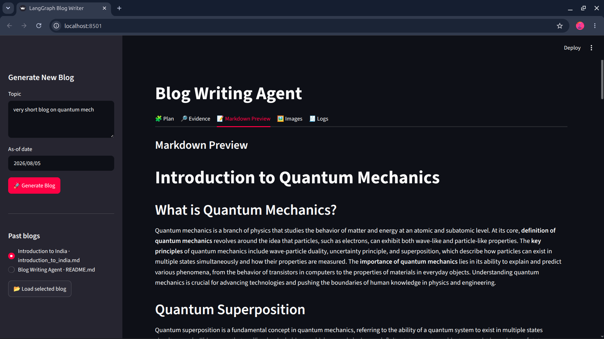

# ✍️ TheWriterAgent

> Multi-Agent AI Blog Writer built with LangGraph that researches, plans, writes, reviews, and generates images for technical blogs.

---

## 📸 Demo

> 


##  Features

-  Multi-Agent workflow using LangGraph
-  Optional web research with Tavily
-  Intelligent blog planning & outlining
-  Section-by-section content generation
-  AI image generation
-  Markdown export
-  Streamlit UI

---

##  Architecture

```text
                                         ┌──────────────┐
                         │    User      │
                         └──────┬───────┘
                                │
                                ▼
                     ┌────────────────────┐
                     │    Streamlit UI    │
                     └─────────┬──────────┘
                               │
                               ▼
                   ┌────────────────────────┐
                   │ LangGraph Orchestrator │
                   └─────────┬──────────────┘
                             │
      ┌──────────────┬───────────────┬───────────────┐
      ▼              ▼               ▼               ▼
   Router        Research        Planner         Image Planner
      │              │               │
      │           Tavily API         │
      │              │               │
      └──────────────┴───────┬───────┘
                             ▼
                   Parallel Writer Agents
                             │
                             ▼
                       Merge Sections
                             │
                             ▼
                    Gemini Image Generator
                             │
                             ▼
                Markdown + Images + Download
```

---

##  Tech Stack

- Python
- LangGraph
- LangChain
- Streamlit
- Groq
- Tavily
- Gemini Image API

---

##  Project Structure

```text
.
├── backend.py
├── frontend.py
├── requirements.txt
├── images/
└── README.md
```

---

## ▶ Run

```bash
pip install -r requirements.txt
streamlit run frontend.py
```

Create `.env`

```env
GROQ_API_KEY=
TAVILY_API_KEY=
GOOGLE_API_KEY=
```

---

## ⭐ If you like this project, consider giving it a star!